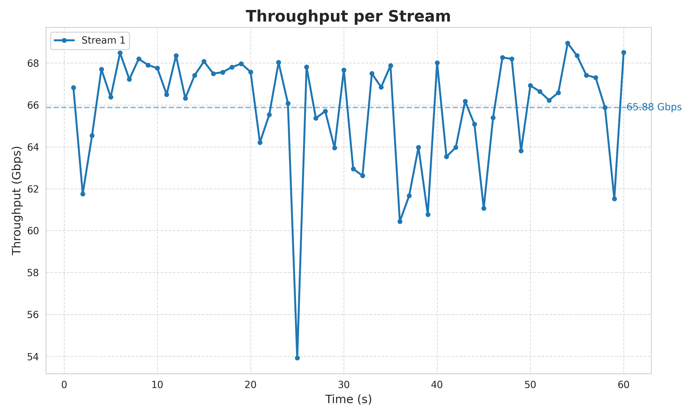
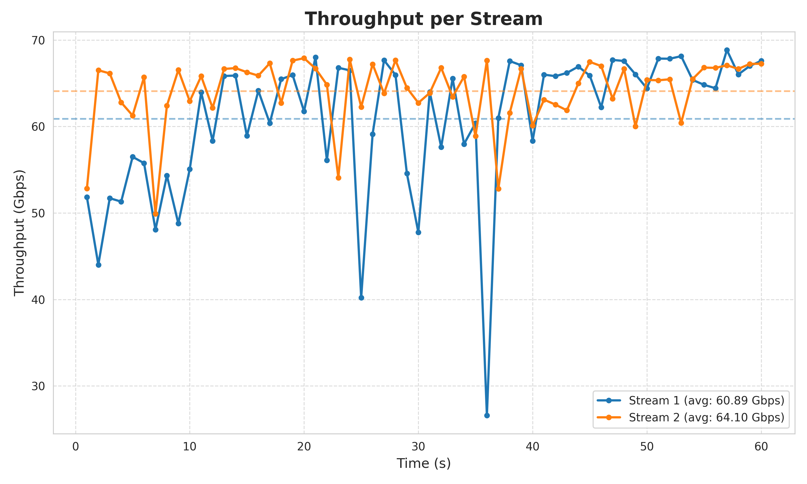
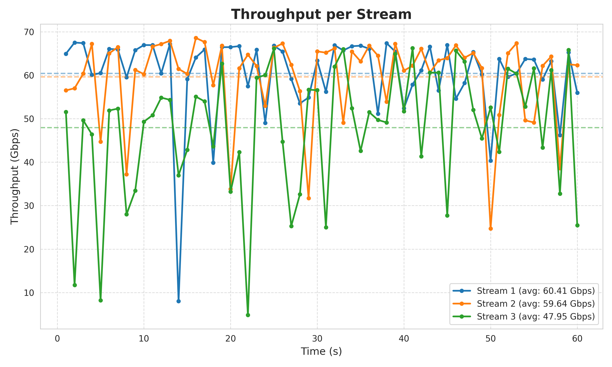
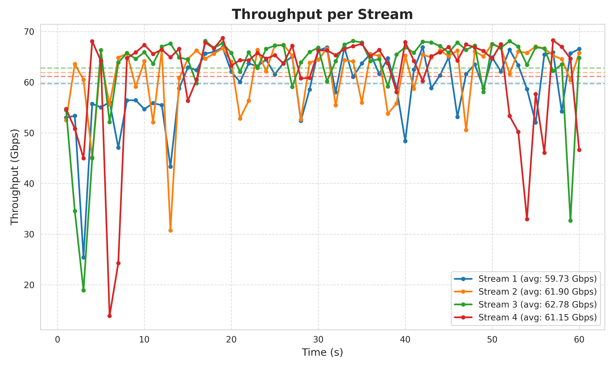
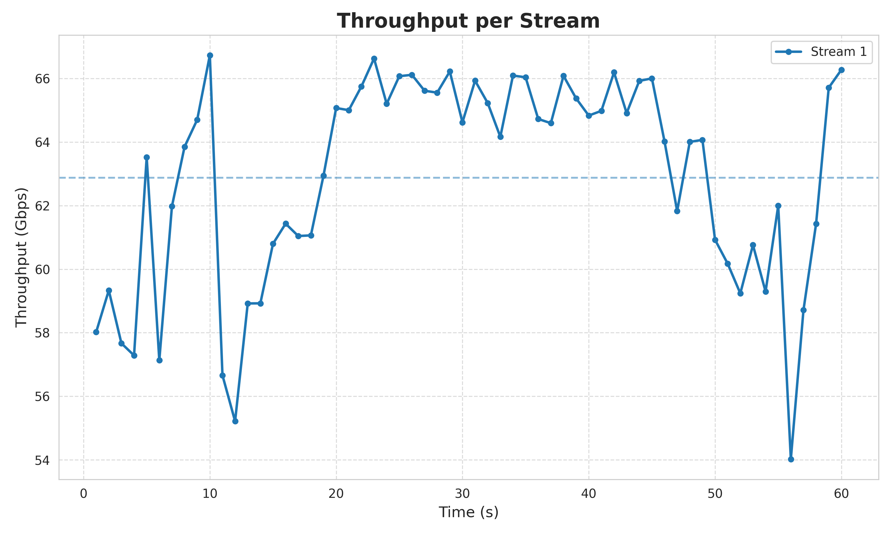
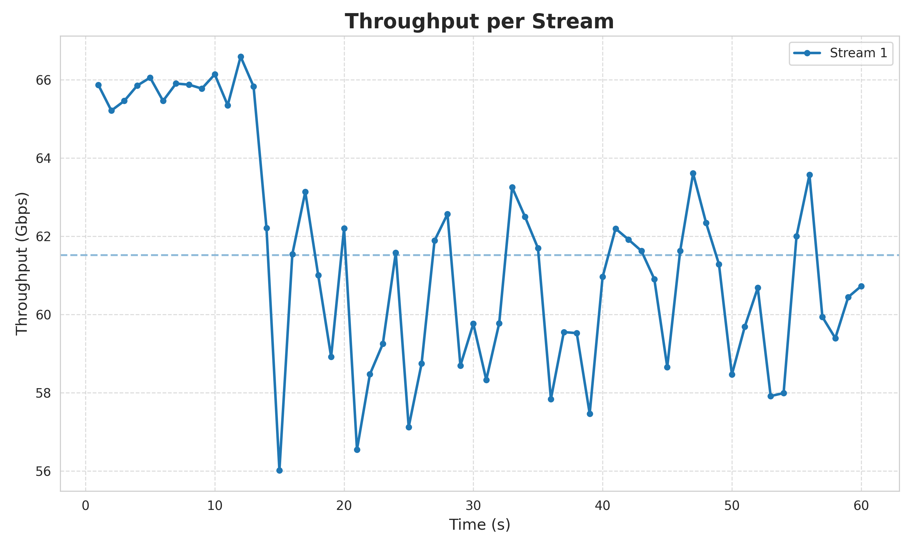
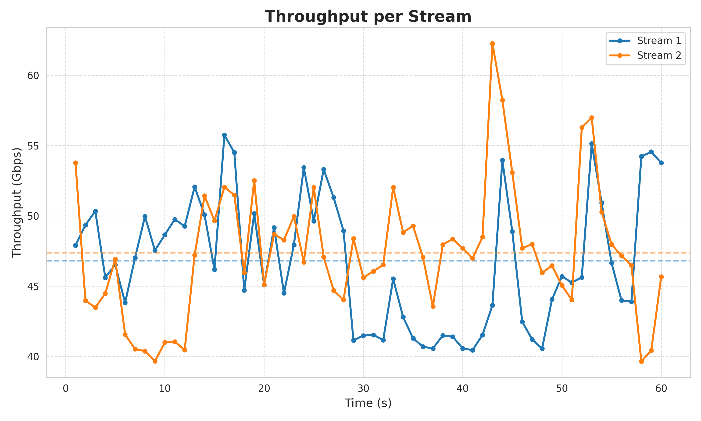
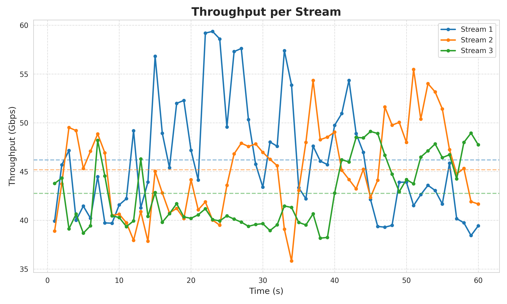
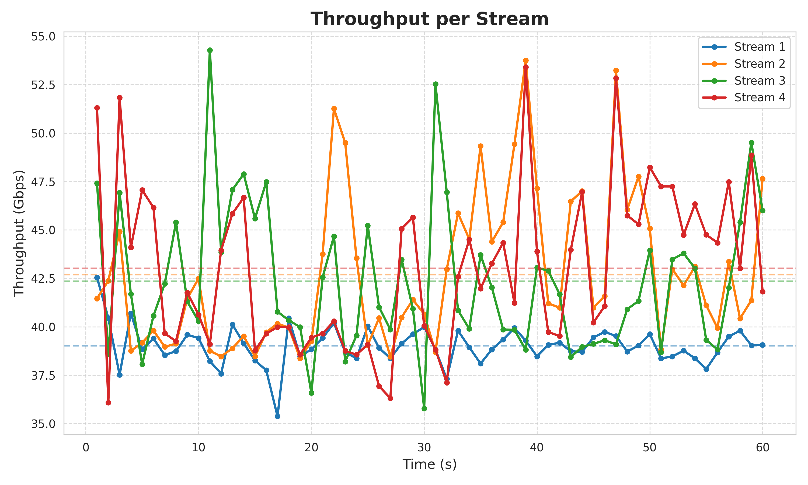

# Results


## iperf3 plotter

```bash

mkdir mio_progetto
cd mio_progetto

python3 -m venv venv

source venv/bin/activate

pip install matplotlib 
pip install seaborn

deactivate


git clone https://github.com/rafaeloliveira00/iperf3-plotter.git
pip install matplot
python3 iperf_plotter.py sample.json

./script_iperf3.sh 1 && ./script_iperf3.sh 2 && ./script_iperf3.sh 3 && ./script_iperf3.sh 4
```


## local iperf3

```bash
numactl --cpunodebind=0 --membind=0 iperf3 -s -p 7777
numactl --cpunodebind=0 --membind=0 iperf3 -c 127.0.0.1 -p 7777 -t 60 -i 1 -J -P 1 > tcp_local_1_stream.json
numactl --cpunodebind=0 --membind=0 iperf3 -c 127.0.0.1 -p 7777 -t 60 -i 1 -J -P 2 > tcp_local_2_stream.json
numactl --cpunodebind=0 --membind=0 iperf3 -c 127.0.0.1 -p 7777 -t 60 -i 1 -J -P 3 > tcp_local_3_stream.json
numactl --cpunodebind=0 --membind=0 iperf3 -c 127.0.0.1 -p 7777 -t 60 -i 1 -J -P 4 > tcp_local_4_stream.json
```

graph:







## iperf3 local eBPF

```bash
sudo numactl --cpunodebind=0 --membind=0 iperf3 -s -p 7777

sudo numactl --cpunodebind=0 --membind=0 iperf3 -c 127.0.0.1 -p 7777 -t 60 -i 1 -J -P 1 > tcp_local_ebpf_1_stream.json

sudo numactl --cpunodebind=0 --membind=0 iperf3 -c 127.0.0.1 -p 7777 -t 60 -i 1 -J -P 1 > tcp_local_ebpf_1_stream_2.json

sudo numactl --cpunodebind=0 --membind=0 iperf3 -c 127.0.0.1 -p 7777 -t 60 -i 1 -J -P 2 > tcp_local_ebpf_2_stream.json

sudo numactl --cpunodebind=0 --membind=0 iperf3 -c 127.0.0.1 -p 7777 -t 60 -i 1 -J -P 3 > tcp_local_ebpf_3_stream.json

sudo numactl --cpunodebind=0 --membind=0 iperf3 -c 127.0.0.1 -p 7777 -t 60 -i 1 -J -P 4 > tcp_local_ebpf_4_stream.json
```

graph:





